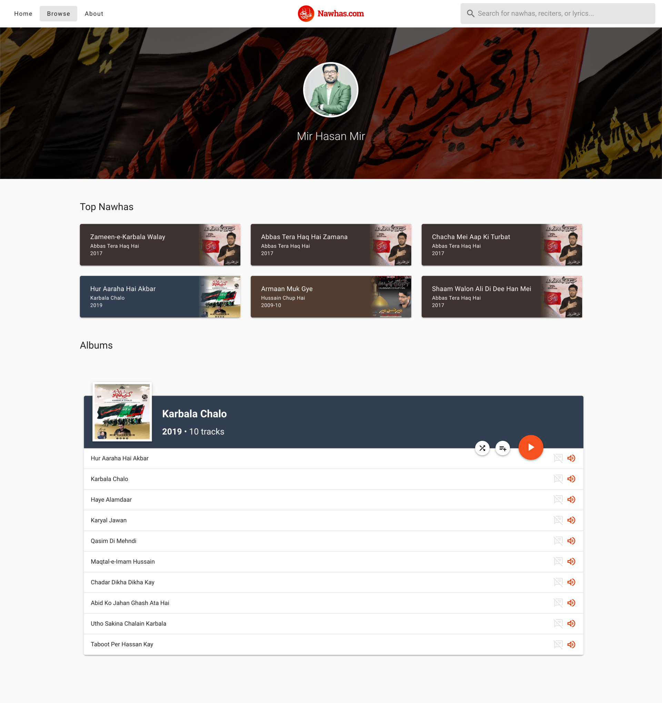

# Audio Player: Add Album to Queue
**Authors:** [@shea786](https://github.com/shea786)  
**Type:** Feature

## Overview
Allow the user to add the entire album to the audio player queue

## Why are we making this change?
Playing an entire album is a common feature users expect and a feature Nawhas.com is currently lacking.

## Requirements
- User should be able to an entire album to the playlist
- The order in which the tracks are being displayed is the order of which the tracks should be added to the queue
- On the Reciter page: user should be able to play all tracks from the album
- On the Track page: the "More From This Album" card should allow users to play all tracks from the album
- When adding all tracks from an album to the queue, if the queue is shuffled then add the new tracks to the shuffled queue in random order

## Detailed Eng Design
### API
No changes made to API

### Frontend
#### Reciter Profile
  - Add a new button against the album table to add all tracks to the album
  - Add a new method named `addAlbumToQueue` which will commit a new mutation on the `player` store to add the tracks to the queue

#### Tracks Page
  - Add a new button above the tracks from this album to add album to the queue
  - Add a new method named `addAlbumToQueue` which will commit a new mutation on the `player` store to add the tracks to the queue

- Proposed button name for `Reciter Profile` and `Tracks Page` - `Add Album to Queue`

#### Vuex
##### Player Store
  - Adding a new mutation named `ADD_ALBUM_TO_QUEUE`
  - This new mutation will accept an array of tracks
  - Will loop through each track and add the track to the queue
  - If the queue is currently shuffled
    - Pass the list of tracks received to the `shuffle` function to generate a random order
    - Then push the shuffled array to the `shuffled` queue

### Migration Path
No changes to migration

### Deployment Strategy

## Mockups
Mockups by [@szainmehdi](https://github.com/szainmehdi)  
