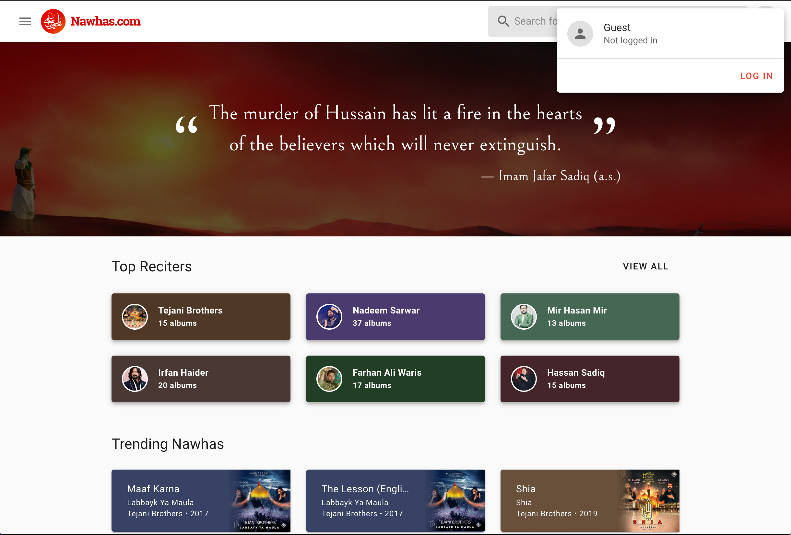
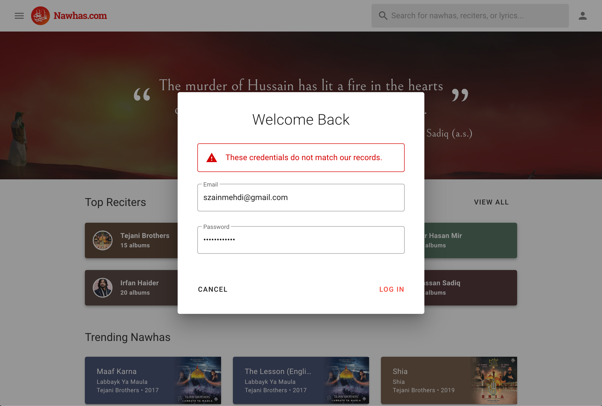
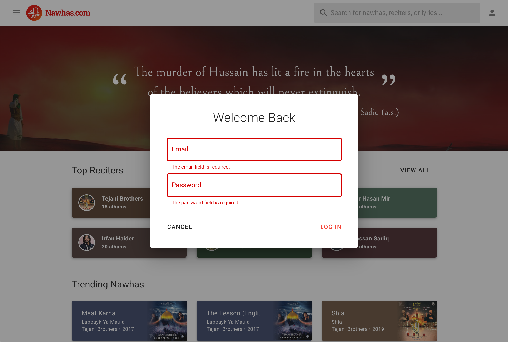
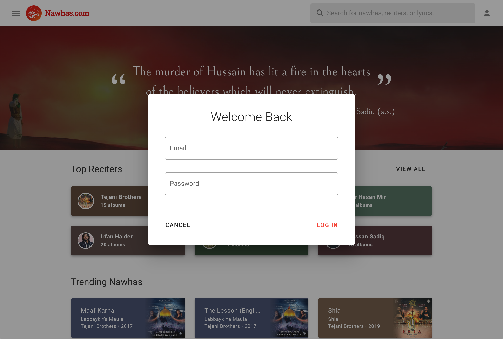
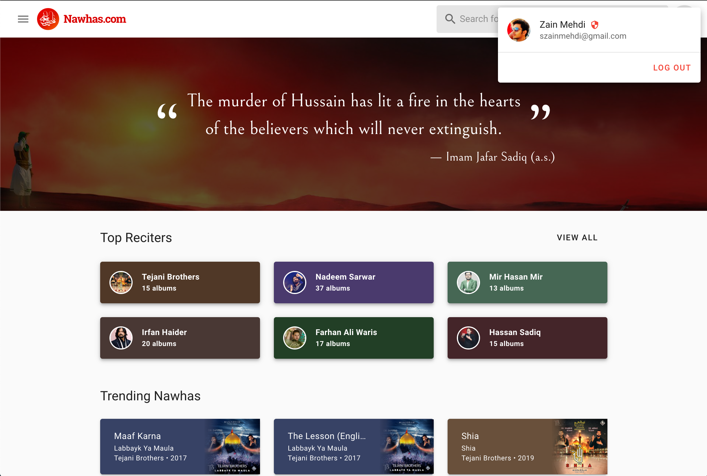

# Authentication v1
**Authors:** [@szainmehdi](https://github.com/szainmehdi)
**Type:** Feature

## Overview
This phase of Authentication covers allowing Moderators to login to the site and manage content. 

### Definitions

| Term        | Definition                                            |
| ----------- | ----------------------------------------------------- |
| Engineer    | A person with code & infrastructure control.          |
| Moderator   | A privileged user with full edit and approval rights. |
| Contributor | A standard user that has limited edit rights.         |
| User        | Either a Moderator or a Contributor                   |

## Why are we making this change?
To achieve the greater effort of allowing public edit access on Nawhas.com, enabling moderators to log in is a prerequisite. This change will also lay the foundation for the overall authentication system and enable Contributor registration and logins in the future.

## Requirements
- Engineers can provision a Moderator account.
- Moderators can log in to Nawhas.com with an email address and password.
- Moderators can log out of Nawhas.com to end their session.
- The frontend application can determine if a User is logged in.
- The frontend application can determine if a User is a Moderator.

## Detailed Engineering Design

### API

#### New Endpoints
We'll add three new endpoints to the API:

```
POST /v1/auth/login
{
  "email": string,
  "password": string,
  "remember": ?bool,
}
RESPONSES
  - 200: Logged in
         { user: { ... } }
ERRORS
  - 401: Invalid credentials
         { message: "..." }
  - 422: Invalid request
         { message: "...", "errors": { email: "...", ... } }

[guard:auth]
POST /v1/auth/logout
RESPONSES
  - 204: No content
  - 401: Unauthorized
         { message: "..." }

[guard:auth]
GET /v1/auth/user
RESPONSES
  - 200: User in session
         { user: { ... } }
  - 401: Unauthorized
         { message: "..." }
```

#### User Entity

We'll add a new `User` entity with the following fields.

```php
private UuidInterface $id;
private string $name;
private ?string $nickname;
private Role $role;
private string $email;
private string $password;
private ?string $rememberToken;
```

`Role` above refers to an enum with two possible values as of now:

```php
public const MODERATOR = 'moderator';
public const CONTRIBUTOR = 'contributor';
```

This should be sufficient for now.

#### Caveats
We'll utilize [Laravel Airlock](https://laravel.com/docs/7.x/airlock) for the basics of SPA authentication. A few caveats:

**This solution only works if the SPA (the frontend) and the API (the backend) are on the same top-level domain (i.e. nawhas.com)**
- We will no longer be able to use `https://localhost:8080` for local dev. This will need to switch over to `https://nawhas.test:8080` which is supported by Webpack Dev Server.
- PR Preview environments on Render are hosted on `*.onrender.com`, while the API is on `api.staging.nawhas.com`. So, these environments will not work with authentication unless hosted on a `staging.nawhas.com` subdomain.
- We may need to investigate alternative staging PR preview environments.

### Frontend
We'll be replacing the existing `auth` store with a new one, and hooking up a couple components.

#### Vuex Store
A new `auth` store written in Typescript will be created and replace the existing (outdated and unused) `auth` store. 

#####  State
```
// Store the user object
user: object|null;

// Used to determine if the first auth check has completed.
initialized: bool = false;
```

##### Mutations

- Add `INITIALIZE`
  - When the application boots up, a call to get a CSRF cookie and the current session state will be done, and this mutation will be called. 
  - Sets `initialized` to `true` in the state, along with a `user` object if found.
- Add `LOGIN`
  - Sets the `user` object in the state.
- Add `LOGOUT`
  - Removes the `user` object from the state.

##### Getters
- Add `authenticated` getter
  - A simple boolean getter to determine if the user is logged in.

- Add `role` getter
  - Return the role from the authenticated user, or return `guest`.


##### Actions
- `login` - Post to the login API endpoint and commit `LOGIN`
- `logout` - Commit `LOGOUT` and post to the logout API endpoint.
- `check` - 
  - Make a request to get the CSRF cookie from airlock
  - Attempt to get the user from the session (`/v1/auth/user` endpoint). 
  - Commit `INITIALIZE`

#### App.vue

When the frontend loads for the first time, we'll dispatch the `auth/check` action to initialize the auth store and grab a CSRF cookie.

####  UserMenu Component
We'll add a new `UserMenu` component that will be responsible for drawing the current auth state along with relevant auth actions.

This component will be rendered into the app navbar in `Public.vue`

#### LoginForm Component
A `LoginForm` component will handle the processes of:
- gathering user input for email address and password
- dispatching the `auth/login` action
- handling validation errors

### Deployment Strategy
This code should be safe to roll out to 100% of users. The API changes will go out first, and the frontend will go out after a successful API deploy.

## Mockups






