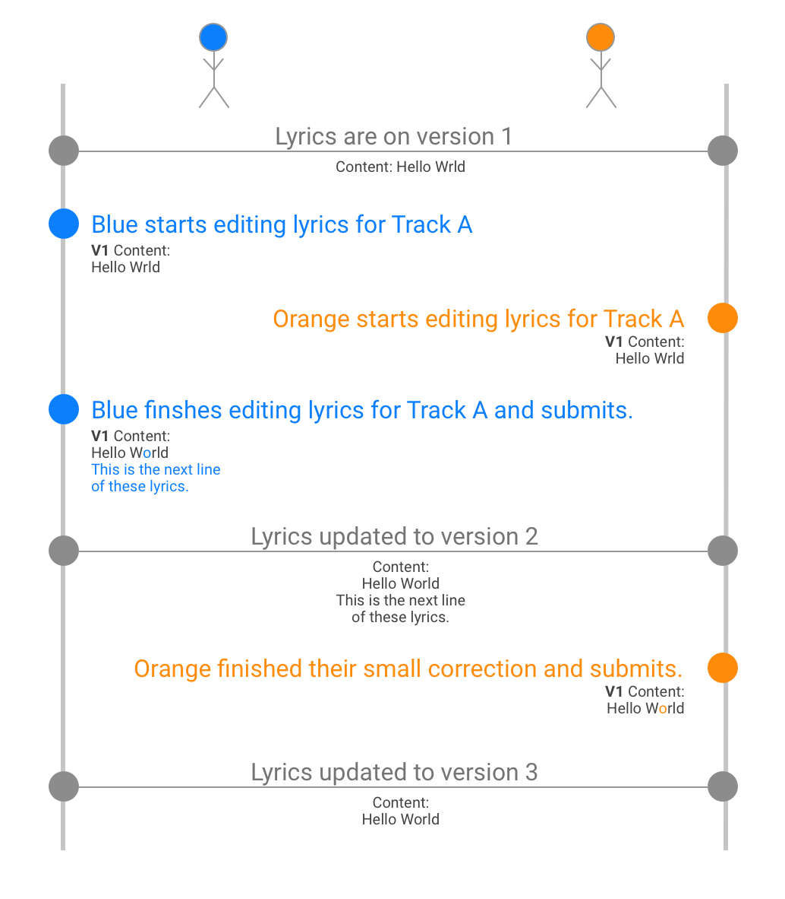

# Patching Lyrics
**Authors:** [@szainmehdi](https://github.com/szainmehdi)  
**Type:** Feature

## Overview
This change will allow tracking changes to lyrics in a much more robust way, giving us the tools to handle content editing in a much more sophisticated way and paving the way for advanced moderation features. Read on for more.

### Definitions
<!-- 
Define terms used in this document, if not obvious. 
Remove this section if unnecessary. 
-->

| Term            | Definition                                                        |
| --------------- | ----------------------------------------------------------------- |
| Lyrics Document | refers to the JSON or Plain Text content of the lyrics model      |
| Lyrics Entity   | refers to the entity and corresponding database schema for Lyrics |

## Why are we making this change?

Let's take a moment to highlight each of the potential problems this feature may help solve.

### Conflicting Changes

Currently, if multiple users edit lyrics for the same track simultaneously, we have a major problem: whoever submits their changes **last** wins. The previous changes are simply ignored/overwritten. The timeline below might help illustrate the issue.

As you can see above, **Blue** could have spent 15 minutes tediously writing up the lyrics for the track. **Orange** on the other hand just made a simple correction. If the timing is right, the change made by **Orange** can completely blow away the changes made by **Blue**.

A couple notes: we can prevent this from happening without major changes. We simply need to make sure that the version of tracks a user is editing is still the active version when we're saving the new content, otherwise, we reject the changes.

That leads to another issue though. Let's reverse the roles in the timeline and make it so that **Orange** makes massive changes and **Blue** makes a tiny spelling correction. If we implemented a "reject-if-out-of-date" policy, we'd end up throwing away all of **Orange**'s work because **Blue** got through first. This is unideal.

Instead of a "reject-if-out-of-date" policy, we could _allow  conflicting changes_ but then log/alert moderators to review situations of the sort. After all, we do have a historical log of every single _version_ of the lyrics. But this approach also leads to some undesirable situations. Human intervention is required whenever this situation arises, and worse, there's no easy way to merge the changes together. (Suppose **Orange** fixed 100 misspellings, while **Blue** added timestamps to the entire track. How do we preserve both contributions?) 

## Requirements
<!-- Provide a list of acceptance criteria. Example:
- Engineers can provision a Moderator account.
- Moderators can log in to Nawhas.com with an email address and password.
- Moderators can log out of Nawhas.com to end their session.
- The frontend application can determine if a User is logged in.
- The frontend application can determine if a User is a Moderator.
-->

## Detailed Engineering Design

### API
<!-- Describe any changes necessary to the API to make this feature possible. -->

### Frontend
<!-- Describe any changes necessary to the Vue app to make this feature possible. -->

### Deployment Strategy
<!-- Describe rollout strategy. -->

## Mockups
<!-- Attach relevant mockups here. Links to Figma are also appropriate. -->